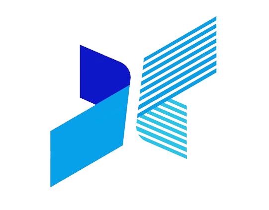

<div align="center">
  
  <h1>GPTCraft</h1>
  <p><strong>Your Intelligent Thinking Partner</strong></p>

  [](https://vitejs.dev/)
  [](https://reactjs.org/)
  [](https://www.typescriptlang.org/)
  [](https://tailwindcss.com/)
  [](https://opensource.org/licenses/MIT)
</div>

---

## 🌟 Overview

GPTCraft is a state-of-the-art AI conversation platform designed for power users who demand efficiency, versatility, and advanced capabilities. Built with modern web technologies, it provides a seamless interface to interact with multiple leading AI models while managing usage quotas through tiered subscription plans.

Whether you're writing code, drafting professional emails, or brainstorming complex strategies, GPTCraft is your companion in the creative and analytical process.

## ✨ Key Features

- **⚡ Real-time Streaming**: Experience lightning-fast responses with token-by-token streaming, eliminating the wait for long generations.
- **🤖 Multi-Model Support**: Switch seamlessly between industry leaders like **GPT-4**, **Claude 3 Opus**, and **GPT-3.5 Turbo**.
- **💳 Tiered Quota Management**: Built-in tracking for tokens and requests across Free, Super, and Hyper plans to ensure optimal resource allocation.
- **🔐 Secure Authentication**: Enterprise-grade security using JWT-based authentication to keep your data and sessions protected.
- **🎨 Modern UI/UX**: A premium dark-themed interface featuring glassmorphism, responsive design, and smooth animations powered by Framer Motion.
- **🎲 3D Experience**: Integrated interactive 3D elements powered by Spline for a unique and immersive user experience.
- **📝 Code Highlighting**: Full syntax highlighting support for dozens of programming languages with easy-to-use copy features.

## 🚀 Tech Stack

- **Frontend Core**: [React 19](https://react.dev/), [TypeScript](https://www.typescriptlang.org/)
- **Build Tool**: [Vite 6](https://vitejs.dev/)
- **Styling**: [Tailwind CSS 4](https://tailwindcss.com/), [Framer Motion](https://www.framer.com/motion/)
- **Icons**: [Lucide React](https://lucide.dev/)
- **3D Graphics**: [Spline](https://spline.design/)
- **Routing**: [React Router 7](https://reactrouter.com/)
- **AI Integration**: [Google Gemini SDK](https://ai.google.dev/)

## 🛠️ Getting Started

### Prerequisites

- [Node.js](https://nodejs.org/) (Version 18 or higher recommended)
- [npm](https://www.npmjs.com/) or [yarn](https://yarnpkg.com/)

### Installation

1. **Clone the repository:**
   ```bash
   git clone https://github.com/yourusername/gptcraft.git
   cd gptcraft
   ```

2. **Install dependencies:**
   ```bash
   npm install
   ```

3. **Configure Environment Variables:**
   Create a `.env` file in the root directory (using `.env.example` as a template).
   ```bash
   cp .env.example .env
   ```
   Add your API keys:
   ```env
   GEMINI_API_KEY=your_gemini_api_key_here
   ```

4. **Launch Development Server:**
   ```bash
   npm run dev
   ```

The application will be available at `http://localhost:3000`.

## 📂 Project Structure

```text
gptcraft/
├── public/             # Static assets (logos, icons)
├── src/
│   ├── components/     # Reusable UI components
│   ├── context/        # React Context providers (Auth)
│   ├── hooks/          # Custom React hooks (Chat, Quotas)
│   ├── pages/          # Main page components (Home, Chat, Login)
│   ├── services/       # API abstraction and mock services
│   ├── styles/         # Global styles and Tailwind configuration
│   └── types/          # TypeScript interface definitions
├── index.html          # Entry HTML
└── vite.config.ts      # Vite configuration
```

## 🤝 Contributing

We welcome contributions from the community! To contribute:

1. Fork the Project
2. Create your Feature Branch (`git checkout -b feature/AmazingFeature`)
3. Commit your Changes (`git commit -m 'Add some AmazingFeature'`)
4. Push to the Branch (`git push origin feature/AmazingFeature`)
5. Open a Pull Request

## 📄 License

Distributed under the MIT License. See `LICENSE` for more information.

---

<div align="center">
  <p>Built with ❤️ for the AI Community</p>
  <a href="https://github.com/yourusername/gptcraft">View Repository</a>
  <span> • </span>
  <a href="https://github.com/yourusername/gptcraft/issues">Report Bug</a>
</div>
